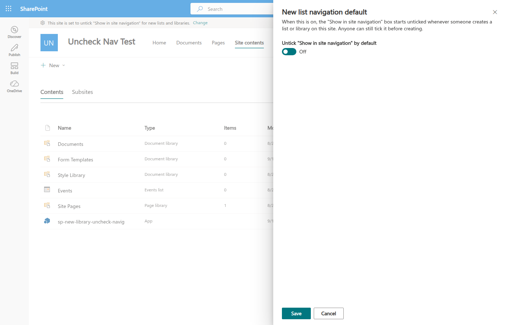

# sp-new-library-uncheck-navigation

SharePoint Framework (SPFx) **Application Customizer** that defaults the
**"Show in site navigation"** checkbox to **unchecked** in the modern
*Create list* and *Create document library* panels.

SharePoint has no server-side setting for this default, so the customizer works
on the rendered page: it observes DOM mutations, finds the checkbox (or Fluent UI
toggle) whose accessible label matches a configured string, and clicks it if it
is checked. Each control is only targeted once, so a user who deliberately
re-ticks the box is not overridden.

Two details matter for how it does that:

- The modern create experience is hosted in a **same-origin iframe**
  (`/_layouts/15/createlist.aspx?dlg=true`) where SPFx extensions do not load.
  The customizer therefore also observes every same-origin iframe it can reach
  from the page and re-hooks them whenever they navigate.
- The document-library panel renders its checkbox before React has attached its
  handlers, so a single early click is dropped. After clicking, the customizer
  verifies the state and retries with a short backoff (150 ms to 1.5 s).

## Build

Requires Node 22.x (see `engines` in `package.json`).

```bash
npm install
npm run build          # lint + compile + bundle + package
```

The package is written to `sharepoint/solution/sp-new-library-uncheck-navigation.sppkg`.

## Release

```bash
./scripts/release            # bump version, build, commit, tag vX.Y.0.Z, publish GitHub Release
./scripts/release --no-publish   # bump and build only; prints the manual steps
```

Write the `## [X.Y.0.Z]` entry in `CHANGELOG.md` before running it (the script
refuses to publish without one). The version is bumped across `package.json`,
`package-lock.json` and `config/package-solution.json` by `increment-version.sh`,
which aligns them to the highest version found and increments the patch. The
`.sppkg` is never committed; it is attached to the GitHub Release.

## Deploy

1. Upload the `.sppkg` to the tenant App Catalog (or a site collection App Catalog).
2. Add the app to each site collection where you want the behaviour.
   Adding the app activates a feature that registers the Application Customizer
   custom action on the site.

To remove the behaviour, remove the app from the site, or switch it off from the
settings panel described next.

## Switching it on or off per site

On **Site contents**, users with *Manage Web* permission (site owners) see a one-line
status bar at the top of the page saying what the current default is, with a
**Change** link. It opens a panel with a single toggle; **Save** writes the choice
back to the site.



The panel can also be opened by URL, for linking from a help page or a Site
Settings-style landing page of your own:

```
https://tenant.sharepoint.com/sites/YourSite/_layouts/15/viewlsts.aspx?jfdiUncheckNav=settings
```

The setting is stored in the `enabled` property of the customizer's own custom
action (`ClientSideComponentProperties`), so it needs no list, no property bag and
no custom script. A change applies immediately in the tab that saved it; other
users and tabs pick it up on their next page load, once SharePoint's cached page
data expires (typically a few minutes). Admins can flip it from the command line too:

```bash
m365 spo customaction list --webUrl https://tenant.sharepoint.com/sites/YourSite   # find the Id
m365 spo customaction set --webUrl https://tenant.sharepoint.com/sites/YourSite \
  --id <Id> --clientSideComponentProperties '{"enabled":false}'
```

### Why not a Site Settings link?

The obvious home for this would be a link under *Site Administration* on the
classic Site Settings page. That is not possible on a standard modern site:

- App packages cannot declare a custom action with location
  `Microsoft.SharePoint.SiteSettings`; the feature schema rejects it at install
  time ("The 'Location' attribute is invalid ... enumeration constraint failed"),
  and the catalog rejects `~site` URLs.
- Adding such a link afterwards with REST, PnP or CLI returns 403 on sites with
  custom script disabled (the default), even for tenant admins.
- Site Settings is a classic page where application customizers do not run, so
  the panel could not live there anyway.

Site contents is where lists and libraries are created, so the setting sits next
to the behaviour it controls.

## Configuration

The custom action accepts optional `ClientSideComponentProperties`:

| Property | Type       | Default                                                                                          | Purpose |
|----------|------------|--------------------------------------------------------------------------------------------------|---------|
| `labels` | `string[]` | `["Show in site navigation", "Show list in site navigation", "Show library in site navigation"]` | Label texts to match (case-insensitive). Add localised variants for non-English UI. |
| `debug`  | `boolean`  | `false`                                                                                          | Log each match to the browser console. |
| `enabled` | `boolean` | `true`                                                                                           | Switch the behaviour off for the site without removing the app. Managed by the settings panel. |

Defaults live in `sharepoint/assets/elements.xml` and `ClientSideInstance.xml`.
To change them after deployment, update the custom action's
`ClientSideComponentProperties` with PnP PowerShell or CLI for Microsoft 365.

## Local debugging

```bash
npm start
```

Then open the debug URL printed by the tool (it targets `_layouts/15/viewlsts.aspx`,
the Site contents page) and create a list or library.

## End-to-end proof

`e2e/prove.js` is a headed Playwright script that opens Site contents on a site
with the app installed, walks **New → List** and **New → Document library**, and
asserts the checkbox is unchecked. It then repeats on a control site without the
app and asserts the checkbox is checked. Finally it uses the status bar to switch
the customizer **off**, asserts the checkbox is then left checked, switches it
back **on** through the `?jfdiUncheckNav=settings` deep link, and asserts it is
unchecked again. Screenshots land in `docs/proof/`.

```bash
npx playwright install chromium
TEST_SITE=https://tenant.sharepoint.com/sites/WithApp \
CONTROL_SITE=https://tenant.sharepoint.com \
npm run e2e
```

Sign in once in the browser window; the profile persists in `~/.cache/pw-sp-profile`.
If you run behind an authenticating HTTP proxy, set `HTTPS_PROXY` and the script
passes it to the browser.

Last verified 2026-09-10 on tenant g53.sharepoint.com (site `/sites/UncheckNavTest`,
package version 1.0.0.3): `PROOF: PASS`.

| Scenario | List | Document library |
|----------|------|------------------|
| Site with app | unchecked | unchecked |
| Control site without app | checked | checked |
| Site with app, switched off in the panel | checked | (not exercised) |
| Site with app, switched back on via deep link | unchecked | (not exercised) |

## Caveats

- This relies on the label text and structure of Microsoft's UI. If Microsoft
  changes the label, update the `labels` property; if they change the control
  type, the customizer may need a code change.
- The customizer only runs on modern pages. Classic list-creation pages are unaffected.
- The settings bar only appears on Site contents, and only to users who can manage the
  web. Saving needs the same permission; others get a read-only panel via the deep link.
- The panel's own strings are English only (`loc/en-us.js`). On non-English tenants
  remember that the `labels` property must also be set for the customizer to match
  the localised checkbox label; the status bar reports the setting, not whether a
  match has happened.
